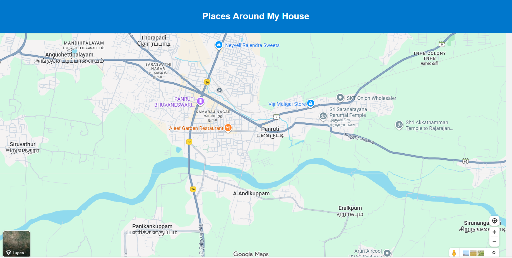
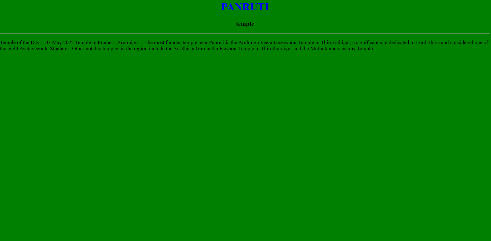
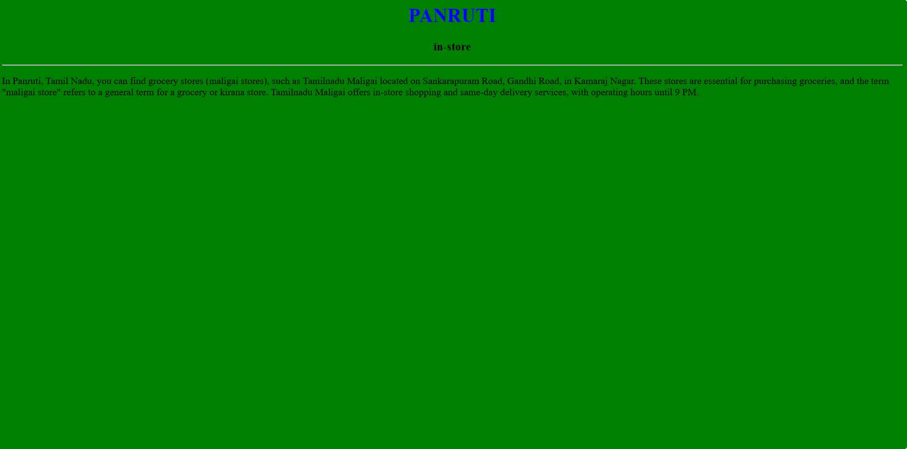
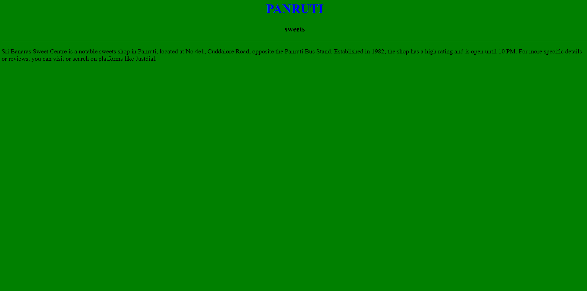
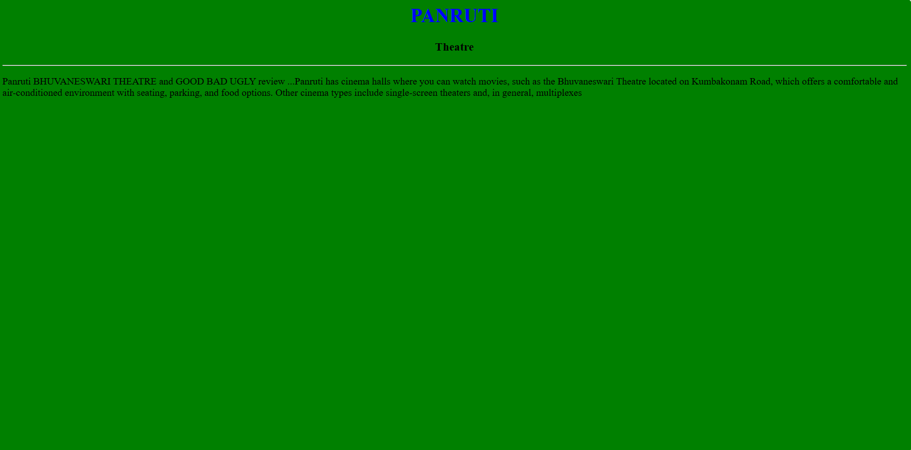
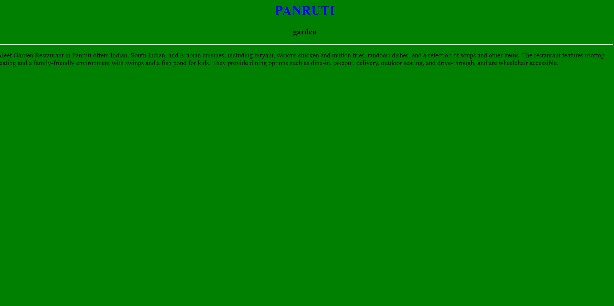

# Ex04 Places Around Me
## Date: 26.09.25

## AIM
To develop a website to display details about the places around my house.

## DESIGN STEPS

### STEP 1
Create a Django admin interface.

### STEP 2
Download your city map from Google.

### STEP 3
Using ```<map>``` tag name the map.

### STEP 4
Create clickable regions in the image using ```<area>``` tag.

### STEP 5
Write HTML programs for all the regions identified.

### STEP 6
Execute the programs and publish them.

## CODE
~~~
map.html

<!DOCTYPE html>
<html lang="en">
<head>
  <title>Places Around My House</title>
  <style>
    body {
      font-family: Arial, sans-serif;
      background-color: #f2f2f2;
      margin: 0;
      padding: 0;
    }
    header {
      background-color: #0077cc;
      color: white;
      padding: 20px;
      text-align: center;
    }
    .container {
      padding: 20px;
    }
    .place {
      background-color: white;
      border-radius: 8px;
      padding: 15px;
      margin-bottom: 20px;
      box-shadow: 0 2px 5px rgba(0,0,0,0.1);
    }
    .place h2 {
      margin-top: 0;
      color: #0077cc;
    }
    .place p {
      margin: 5px 0;
    }
    footer {
      text-align: center;
      padding: 10px;
      background-color: #ddd;
      font-size: 0.9em;
    }
  </style>
</head>
<body>

  <header>
    <h1>Places Around My House</h1>

  </header>
  <center></center>
  <!-- Image Map Generated by http://www.image-map.net/ -->


<map name="image-map">
    <area target="_blank" alt="garden" title="garden" href="garden.html" coords="600,304,841,411" shape="rect">
    <area target="_blank" alt="theatre" title="theatre" href="theatre.html" coords="483,170,754,281" shape="rect">
    <area target="_blank" alt="store" title="store" href="store.html" coords="945,213,1133,296" shape="rect">
    <area target="_blank" alt="sweets" title="sweets" href="sweets.html" coords="745,3,1031,106" shape="rect">
    <area target="_blank" alt="temple" title="temple" href="temple.html" coords="1371,287,1690,403" shape="rect">
</map>
</center>

garden.html

<html>
    <head>
        <title>garden</title>
    </head>
    <body bgcolor="green">
        <h1 align="center">
         <font color="blue"><b>PANRUTI</b></font>  
        </h1>
        <h3 align="center">
            <font color="black"<b>garden</b>
        </h3>
        <hr>
        <p font color="black">Aleef Garden Restaurant in Panruti offers Indian, South Indian, and Arabian cuisines, including biryani, various chicken and mutton fries, tandoori dishes, and a selection of soups and other items. The restaurant features rooftop seating and a family-friendly environment with swings and a fish pond for kids. They provide dining options such as dine-in, takeout, delivery, outdoor seating, and drive-through, and are wheelchair accessible. </p>
        
    </body>
</html>
store.html
<html>
    <head>
        <title>garden</title>
    </head>
    <body bgcolor="green">
        <h1 align="center">
         <font color="blue"><b>PANRUTI</b></font>  
        </h1>
        <h3 align="center">
            <font color="black"<b>in-store</b>
        </h3>
        <hr>
        <p font color="black">In Panruti, Tamil Nadu, you can find grocery stores (maligai stores), such as Tamilnadu Maligai located on Sankarapuram Road, Gandhi Road, in Kamaraj Nagar. These stores are essential for purchasing groceries, and the term "maligai store" refers to a general term for a grocery or kirana store. Tamilnadu Maligai offers in-store shopping and same-day delivery services, with operating hours until 9 PM.
        </body>
        </html>
        sweets.html
        <html>
    <head>
        <title>garden</title>
    </head>
    <body bgcolor="green">
        <h1 align="center">
         <font color="blue"><b>PANRUTI</b></font>  
        </h1>
        <h3 align="center">
            <font color="black"<b>sweets</b>
        </h3>
        <hr>
        <p font color="black">Sri Banaras Sweet Centre is a notable sweets shop in Panruti, located at No 4e1, Cuddalore Road, opposite the Panruti Bus Stand. Established in 1982, the shop has a high rating and is open until 10 PM. For more specific details or reviews, you can visit or search on platforms like Justdial.
        </body> 
</html>
temple.html
<html>
    <head>
        <title>garden</title>
    </head>
    <body bgcolor="green">
        <h1 align="center">
         <font color="blue"><b>PANRUTI</b></font>  
        </h1>
        <h3 align="center">
            <font color="black"<b>temple</b>
        </h3>
        <hr>
        <p font color="black">Temple of the Day :- 03 May 2022 Temple in Frame :- Arulmigu ...
        The most famous temple near Panruti is the Arulmigu Veerattaneswarar Temple in Thiruvathigai, a significant site dedicated to Lord Shiva and considered one of the eight Ashtaveeratta Sthalams. Other notable temples in the region include the Sri Shista Gurunatha Eswarar Temple in Thiruthuraiyur and the Muthukumaraswamy Temple.

</body>
 </html>
 theatre.html
 <html>
    <head>
        <title>garden</title>
    </head>
    <body bgcolor="green">
        <h1 align="center">
         <font color="blue"><b>PANRUTI</b></font>  
        </h1>
        <h3 align="center">
            <font color="black"<b>Theatre</b>
        </h3>
        <hr>
        <p font color="black">
Panruti BHUVANESWARI THEATRE and GOOD BAD UGLY review ...Panruti has cinema halls where you can watch movies, such as the Bhuvaneswari Theatre located on Kumbakonam Road, which offers a comfortable and air-conditioned environment with seating, parking, and food options. Other cinema types include single-screen theaters and, in general, multiplexes 
    </body>
</html>
~~~

## OUTPUT











## RESULT
The program for implementing image maps using HTML is executed successfully.
